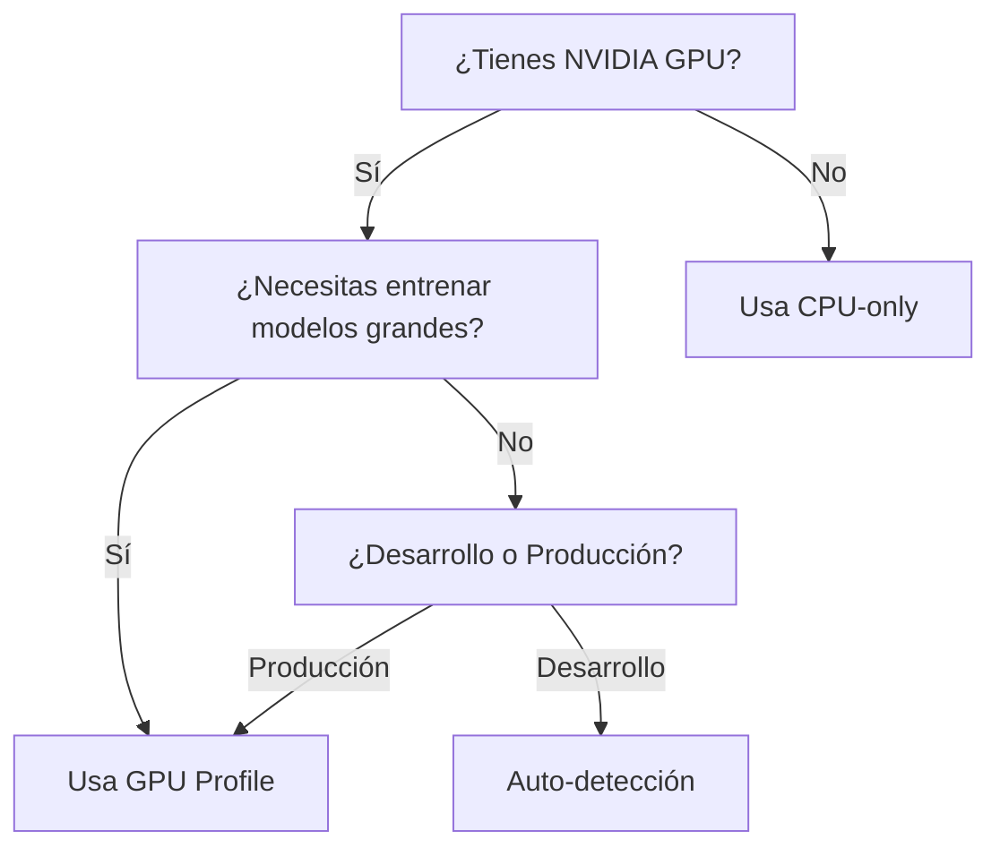

# Guía de Uso: GPU vs CPU

El ML Service de CCB puede funcionar tanto con GPU (acelerado) como con CPU (sin GPU), adaptándose automáticamente al hardware disponible.

## Modos de Ejecución

### 🚀 Modo 1: CPU-only (Por Defecto)

**Ideal para**: 
- Desarrollo sin GPU
- Servidores sin GPU
- Testing y debugging
- Modelos pequeños

**Cómo usar**:
```bash
# Simplemente ejecuta docker-compose normalmente
docker compose up -d

# El ML service usará CPU automáticamente
```

**Características**:
- ✅ No requiere NVIDIA GPU
- ✅ Funciona en cualquier máquina
- ✅ Imagen Docker más ligera (~2GB vs ~8GB)
- ⚠️ Entrenamiento más lento (10-100x dependiendo del modelo)

---

### ⚡ Modo 2: GPU Acelerado (RTX 2070 Super)

**Ideal para**:
- Entrenamiento de modelos grandes
- Procesamiento de datasets masivos
- Producción con alta demanda
- Deep Learning con redes neuronales complejas

**Requisitos**:
1. NVIDIA GPU (en tu caso: RTX 2070 Super ✓)
2. NVIDIA drivers instalados
3. NVIDIA Container Toolkit

**Cómo usar**:
```bash
# Usar el perfil GPU
docker compose --profile gpu up -d

# Verifica que esté usando GPU
curl http://localhost:8000/health
```

**Características**:
- ✅ Entrenamiento ultra-rápido
- ✅ Puede procesar batches grandes
- ✅ Ideal para producción
- ⚠️ Requiere setup de GPU

---

### 🔄 Modo 3: Autodetección (Recomendado para desarrollo)

**Cómo funciona**:
El servicio detecta automáticamente si hay GPU disponible y usa la más apropiada.

**Configurar en .env**:
```env
ML_DEVICE=auto  # Detecta automáticamente (por defecto)
```

**Ventajas**:
- Mismo código funciona en cualquier entorno
- Cambia de GPU a CPU automáticamente si falla
- Ideal para desarrollo híbrido

---

## Comparación de Rendimiento

### Ejemplo: Entrenar modelo de regresión con 100k filas

| Hardware | Tiempo | Costo | Uso Recomendado |
|----------|--------|-------|-----------------|
| **RTX 2070 Super** | ~30s | GPU | Producción, modelos grandes |
| **CPU (8 cores)** | ~5min | CPU | Desarrollo, modelos pequeños |
| **CPU (4 cores)** | ~10min | CPU | Testing básico |

---

## Comandos Útiles

### Iniciar con CPU (sin GPU)
```bash
# Método 1: Por defecto
docker compose up -d

# Método 2: Explícito con perfil
docker compose --profile cpu up -d
```

### Iniciar con GPU
```bash
docker compose --profile gpu up -d
```

### Cambiar de CPU a GPU (sin reconstruir todo)
```bash
# Detener servicio actual
docker compose down ml_service

# Iniciar con GPU
docker compose --profile gpu up -d ml_service_gpu
```

### Cambiar de GPU a CPU
```bash
docker compose down ml_service_gpu
docker compose up -d ml_service
```

### Verificar qué modo está activo
```bash
curl http://localhost:8000/health | jq '.'
```

Verás algo como:
```json
{
  "status": "healthy",
  "cuda_available": true,  // ← false si es CPU
  "gpu": {
    "name": "NVIDIA GeForce RTX 2070 SUPER",
    "memory_allocated": "0.00 GB",
    "memory_reserved": "0.00 GB"
  },
  "pytorch_version": "2.2.0+cu121"  // ← cpu si es CPU-only
}
```

---

## Configuración Manual (Avanzado)

Si quieres forzar un dispositivo específico independientemente de la detección:

**Edita `ml_service/.env`**:
```env
# Forzar GPU (falla si no está disponible)
ML_DEVICE=cuda

# O forzar CPU (ignora GPU incluso si está disponible)
ML_DEVICE=cpu

# O autodetección inteligente
ML_DEVICE=auto
```

---

## Troubleshooting

### ❓ ¿Cómo sé qué modo estoy usando?

```bash
docker logs ccb_ml_service | grep "Detectada\|CPU"
```

Verás:
- `✓ GPU Detectada: NVIDIA...` → Modo GPU
- `ℹ Usando CPU para procesamiento ML` → Modo CPU

### ❓ Tengo GPU pero quiero usar CPU para testing

```bash
# Opción 1: Variable de entorno
export ML_DEVICE=cpu
docker compose up -d ml_service

# Opción 2: Directamente en docker-compose
# (edita docker-compose.yml y cambia ML_DEVICE=cpu)
```

### ❓ El servicio no arranca con GPU

1. Verifica drivers NVIDIA:
   ```bash
   nvidia-smi
   ```

2. Verifica Container Toolkit:
   ```bash
   docker run --rm --gpus all nvidia/cuda:12.1.0-base-ubuntu22.04 nvidia-smi
   ```

3. Si falla, usa modo CPU temporalmente:
   ```bash
   docker compose up -d ml_service
   ```

---

## Recomendación de Uso



**Para tu caso (RTX 2070 Super)**:
- **Desarrollo**: `ML_DEVICE=auto` (detecta automáticamente)
- **Producción**: `docker compose --profile gpu up -d`
- **Testing**: `ML_DEVICE=cpu` (más predecible)

---

## Migración entre Modos

### De CPU a GPU (cuando instalas GPU)
```bash
# 1. Instala NVIDIA Container Toolkit (ver GPU_SETUP.md)
# 2. Reconstruye con GPU
docker compose down
docker compose --profile gpu up -d
# 3. Verifica
curl http://localhost:8000/health
```

### De GPU a CPU (cuando migras a servidor sin GPU)
```bash
# 1. Cambia a perfil CPU
docker compose down
docker compose up -d  # usa CPU por defecto
# 2. El código sigue funcionando igual
```

¡El mismo código funciona en ambos casos! 🎉
